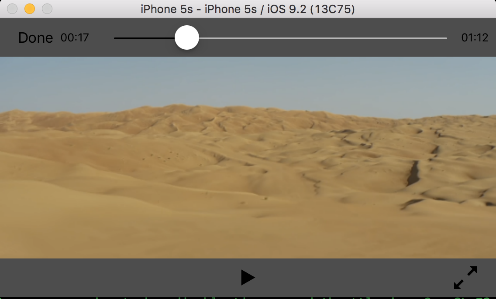

# T5Player-iOS-Sample
# 介绍

本项目是基于[百度T5-Player SDK](https://bce.baidu.com/doc/SDKTool/index.html#iOS)开发的 iOS 播放器Sample。开发者使用百度T5-Player SDK 开发App 会有如下困难：

- T5-Player SDK 只实现了播放引擎，没有提供播放控制界面。
- 调用接口多是异步调用，初级开发者容易在没有同步的情况下错误调用接口。
- 播放引擎通过 Notification 机制向 App 同步状态，使用不太方便。

为了帮助开发者快速而且正确的使用 T5-Player SDK，本项目提供了一套播放器 App 样例代码，其特点包括：

- 简单易用，模块化，可移植。
- 实现基本的播放界面。
- 提供配置属性，可以定制播放界面的行为。
- 封装播放引擎底层异步调用，保证播放状态的一致性。
- 封装Notification，通过 Protocol CyberPlayerViewControllerDelegate 向上层 App 传递状态信息。

# 播放控制界面
CyberPlayerViewController 实现了视频播放控制界面，如下图所示。包括播放/暂停/停止，播放进度显示，Seek等基础功能。



# 界面配置
界面的行为可以通过如下配置属性定制。CyberPlayerViewController 将在初始化的时候通过 `[NSUserDefaults standardUserDefaults]` 读取这些属性的配置。

```
/*
 * Bool value indicate whether to show control after some idle time
 * defaults value is NO
 */
#define CYBERPLAYER_SHOW_CONTROLS_ON_IDLE   @"cyberplayer.isShowControlsOnIdle"

/*
 * Double value indicate the idle time in seconds before hiding control kits
 * defaults value is 3 seconds
 */
#define CYBERPLAYER_DELAY_BEFORE_HIDING_VIEW @"cyberplayer.delayBeforeHidingViewsOnIdle"

#define CYBERPLAYER_DEFAULT_DELAY_BEFORE_HIDING_VIEW 3.0

/*
 * Bool value indicate whether to hide FullScreen Expand and Shrink button
 * defaults value is NO
 */
#define CYBERPLAYER_HIDE_FULL_SCREEN_BUTTON @"cyberplayer.isHideFullscreenButtons"

/*
 * String value indicate Access Key which BCE generats for each account
 */
#define CYBERPLAYER_ACCESS_KEY @"cyberplayer.AccessKey"

/*
 * String value indicate Nib file names which defines the layout of cyberplayer control kit
 */
#define CYBERPLAYER_NIB_FILE_NAME @"cyberplayer.nibfilename"

/*
 *
 * Integer value indicate the video scaling mode in playback view
 * CBPMovieScalingModeNone,        // 无缩放
 * CBPMovieScalingModeAspectFit,   // 同比适配，某个方向会有黑边
 * CBPMovieScalingModeAspectFill,  // 同比填充，某个方向的显示内容可能被裁剪
 * CBPMovieScalingModeAspect_5_4,  // 5:4比例播放
 * CBPMovieScalingModeAspect_4_3,  // 4:3比例播放
 * CBPMovieScalingModeAspect_16_9, // 16:9比例播放
 * CBPMovieScalingModeFill         // 满屏填充，与原始视频比例不一致
 *
 * Default Value is CBPMovieScalingModeAspectFit
 */
#define CYBERPLAYER_SCALING_MODE @"cyberplayer.scalingMode"

/*
 * Bool value indicate whether to clear rendered picture after playback completion.
 * Default value is NO.
 */
#define CYBERPLAYER_SHOULD_CLEAR_RENDER @"cyberplayer.shouldAutoClearRender"

/*
 * Bool value indicate whether to seek accurately in mili-seconds. By default CyberPlay seek in seconds.
 * Default value is NO.
 */
#define CYBERPLAYER_ACCURATE_SEEK @"cyberplayer.accurateSeeking"
```

# 下载与安装

1. 下载本工程
执行下面命令下载本开源工程
```
git clone https://github.com/baidubce/T5Player-iOS-Samples.git
```
2. 下载百度T5-Player SDK 静态库
下载[百度T5-Player SDK](https://bce.baidu.com/doc/SDKTool/index.html#iOS) 至本地，解压后将如下静态库拷贝至目录 `T5Player-iOS-Samples/SingleViewSample/CyberPlayer`

    - libASIHTTP.a
    - libCyberPlayerController.a
    - libGzipCompressor.a
    - libSBJSON.a
    - libBase64.a
    - libCyberPlayerUtils.a
    - libReachability.a

3. 用Xcode打开工程即可编译
